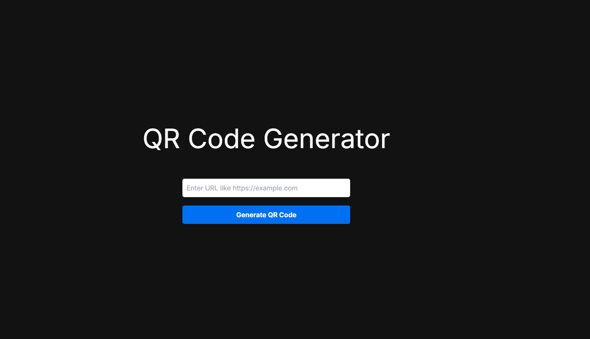
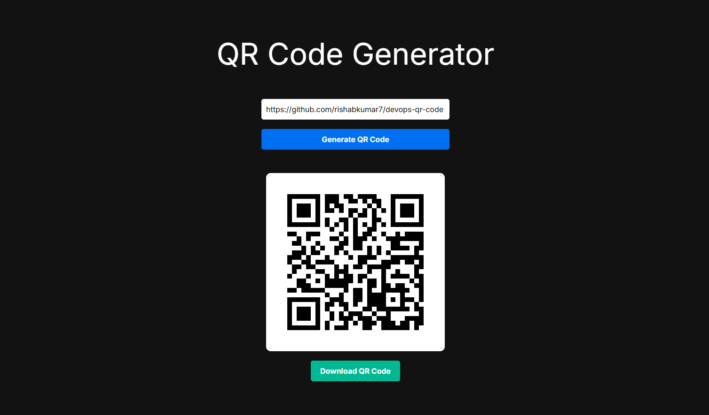

# DevOps-QR-Code
_**Modified**_ from [Original Repo](https://github.com/rishabkumar7/devops-qr-code)
- Using claude I have updated the source code that it doesnt need AWS Credentials (Access and Secret Access Keys) to run. We can implement this project using both AWS Credentials (local testing) and IRSA (Production like).   


   



## AWS Policy Generator

[AWS Policy Generator](https://awspolicygen.s3.amazonaws.com/policygen.html)

## Terraform
- Implemented terraform using self written re-usable modules
- Two terraform states 
    1. Remote S3 Backend with state lock (For VPC and Cluster config)
    2. Local backend (For IRSA and S3 Bucket)

## Update KubeConfig
```Bash
aws eks update-kubeconfig --name qrcode --region us-east-1
```

## ALB Ingress Controller using Helm
[Ingress Controller - AWS Documentation](https://docs.aws.amazon.com/eks/latest/userguide/lbc-helm.html)
```Bash
## Download the policy
curl -O https://raw.githubusercontent.com/kubernetes-sigs/aws-load-balancer-controller/v2.14.1/docs/install/iam_policy.json

## Create the Policy
aws iam create-policy --policy-name AWSLoadBalancerControllerIAMPolicy --policy-document file://iam_policy.json

## Create the Service Account
eksctl create iamserviceaccount \
    --cluster=qrcode \
    --namespace=kube-system \
    --name=aws-load-balancer-controller \
    --attach-policy-arn=arn:aws:iam::747289879815:policy/AWSLoadBalancerControllerIAMPolicy \
    --override-existing-serviceaccounts \
    --region us-east-1 \
    --approve

## Adding eks helm repo
helm repo add eks https://aws.github.io/eks-charts

helm repo update eks

## Install the load balancer and change the VPC-ID accordingly
helm install aws-load-balancer-controller eks/aws-load-balancer-controller \
  -n kube-system \
  --set clusterName=qrcode \
  --set serviceAccount.create=false \
  --set serviceAccount.name=aws-load-balancer-controller \
  --set vpcId=<vpc-id> \
  --version 1.14.0

helm upgrade aws-load-balancer-controller eks/aws-load-balancer-controller \
  -n kube-system \
  --set clusterName=qrcode \
  --set serviceAccount.create=false \
  --set serviceAccount.name=aws-load-balancer-controller \
  --set vpcId=<vpc-id> \
  --version 1.14.0

```

## Tools Installation
```Bash
## Terraform
wget -O- https://apt.releases.hashicorp.com/gpg | sudo gpg --dearmor -o /usr/share/keyrings/hashicorp-archive-keyring.gpg
echo "deb [signed-by=/usr/share/keyrings/hashicorp-archive-keyring.gpg] https://apt.releases.hashicorp.com $(lsb_release -cs) main" | sudo tee /etc/apt/sources.list.d/hashicorp.list
sudo apt update && sudo apt install terraform

## aws cli installation
curl "https://awscli.amazonaws.com/awscli-exe-linux-x86_64.zip" -o "awscliv2.zip"
unzip awscliv2.zip
sudo ./aws/install

## helm installation
sudo apt-get install curl gpg apt-transport-https --yes
curl -fsSL https://packages.buildkite.com/helm-linux/helm-debian/gpgkey | gpg --dearmor | sudo tee /usr/share/keyrings/helm.gpg > /dev/null
echo "deb [signed-by=/usr/share/keyrings/helm.gpg] https://packages.buildkite.com/helm-linux/helm-debian/any/ any main" | sudo tee /etc/apt/sources.list.d/helm-stable-debian.list
sudo apt-get update
sudo apt-get install helm
```

## Metrics Server Installation
```bash
kubectl apply -f https://github.com/kubernetes-sigs/metrics-server/releases/latest/download/components.yaml
```

## Deploying Application using Helm
```Bash
cd helm\ chart/

helm install qrcode .

# or
helm install qrcode "./helm chart"
```

## Prometheus and Grafana Installation
```Bash
helm repo add prometheus-community https://prometheus-community.github.io/helm-charts/

helm repo update

helm install prometheus prometheus-community/kube-prometheus-stack --namespace monitoring --create-namespace

kubectl get secret --namespace monitoring -l app.kubernetes.io/component=admin-secret -o jsonpath="{.items[0].data.admin-password}" | base64 --decode ; echo

kubectl port-forward svc/prometheus-grafana 5000:80  -n monitoring & kubectl port-forward svc/prometheus-kube-prometheus-alertmanager 9093:9093 -n monitoring & kubectl port-forward svc/prometheus-kube-prometheus-prometheus 9090:9090 -n monitoring &
```